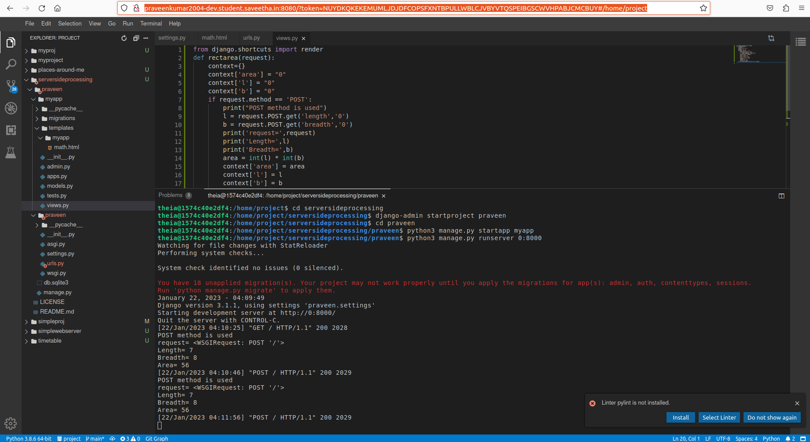
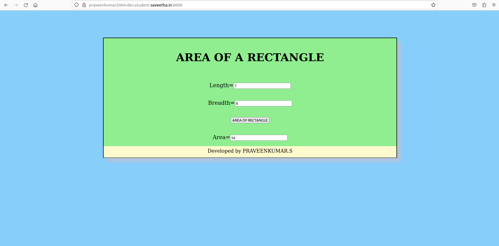

# Design a Website for Server Side Processing

## AIM:
To design a website to perform mathematical calculations in server side.

## DESIGN STEPS :
## Step 1:
Desing your website for calculation using wireframe work.

## Step 2:
Then to execute the wireframe work desing use html,css

## Step 3:
Use views.py to execute the coding in serverside.

## Step 4:
Mention the path of the website in urls.py.

## Step 5:
Publish the website in the given URL'Praveenkumar2004-dev.student.saveetha.in'

## Step 6:
Publish the website in the given URL.

## PROGRAM :
```
math.html

<html>
<head>
    <meta charset='utf-8'>
    <meta http-equiv='X-UA-Compatible' content='IE=edge'>
    <title>Page Title</title>
    <meta name='viewport' content='width=device-width, initial-scale=1'>
    
</head>
<style>
    body {
  background-color: lightskyblue;
}
    .container{
    width: 1080px;
    height: 440px;
    margin-top: 100px;
    margin-left: auto;
    margin-right: auto;
    border-width: 2px 2px 2px 2px;
    border-style: solid;
    box-shadow: 15px 15px 8px lightsteelblue;
    
}
    .heading{
        text-align: center;
    }
    .element{
        padding-top: 20px;
        padding-bottom: 20px;
        padding-left: 20px;
        padding-right:20px;
        text-align: center;
        font-size: 20px;
        background-color:lightgreen;
        
    }
    .footer{
        display: block;
        width: 100%;
        height: 35px;
        background-color:lemonchiffon;
        color: black;
        text-align: center;
        padding-top: 7px;
        font-size: large;
        
        }
</style>

<body>
     
    <div class="container">
        <div class="element", backgroung color="white">
        <h1  class="heading">AREA OF A RECTANGLE</h1>
        </div>
        <form method="POST">
            
            <div class="element"> 
                Length=<input type="text" name="length" value={{length}}></input><br/>
            </div>
            <div class="element">
                Breadth=<input type="text" name="breadth" value={{breath}}></input><br/>
            </div>
            <div class="element">
                <input type="submit" value="AREA OF RECTANGLE"></input><br/>
            </div>
            <div class="element">
                Area=<input type="text" name="area" value={{area}}></input>
            </div>
            <div class="footer">
                    Developed by PRAVEENKUMAR.S
            </div>
        </form>
    </div>
    
</body>
</html>

views.py
from django.shortcuts import render
def rectarea(request):
    context={}
    context['area'] = "0"
    context['l'] = "0"
    context['b'] = "0"
    if request.method == 'POST':
        print("POST method is used")
        l = request.POST.get('length','0')
        b = request.POST.get('breadth','0')
        print('request=',request)
        print('Length=',l)
        print('Breadth=',b)
        area = int(l) * int(b)
        context['area'] = area
        context['l'] = l
        context['b'] = b
        print('Area=',area)
    return render(request,'myapp/math.html',context)

urls.py

from django.contrib import admin
from django.urls import path
from myapp import views
urlpatterns = [
    path('admin/', admin.site.urls),
    path('areaofrectangle/',views.rectarea,name="areaofrectangle"),
    path('',views.rectarea,name="areaofrectangleroot")
]
```
## OUTPUT:


### Home Page:


## Result:
The program for implementing server side processing is compeleted succesfully.

